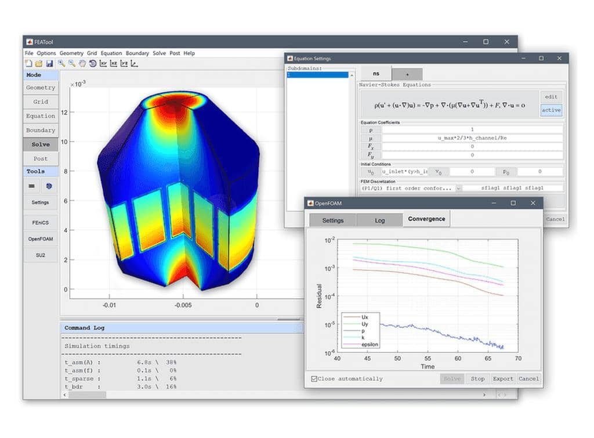

FEATool Multiphysics - _"Physics Simulation Made Easy"_
=======================================================

About
-----

[**FEATool Multiphysics**](https://www.featool.com) (short for
<b>F</b>inite <b>E</b>lement <b>A</b>nalysis <b>Tool</b>box) is a
fully integrated simulation environment for modeling and solving
coupled multi-physics and engineering problems.

_FEATool_ combines geometry creation, meshing, physics definition,
solvers, and postprocessing in a single **easy-to-use** toolbox. It is
designed for engineers solving practical finite element analysis (FEA)
and multiphysics problems, researchers developing and testing new
ideas and models, and students learning mathematical modeling and
numerical simulation.

[Features](https://www.featool.com/featool-multiphysics-features/)
--------

- _GUI_ - Fully integrated and _easy-to-use_ Graphical User Interface
- _Geometry_ - Built-in 1D, 2D, and 3D CAD geometry modeling
- _Meshing_ - Automatic FEA and CFD mesh generation
- _Physics_ - Predefined equations and multiphysics coupling for
  + [Heat and Mass Transfer](https://www.featool.com/multiphysics/#heat-and-mass-transfer)
  + [Fluid Dynamics (CFD)](https://www.featool.com/computational-fluid-dynamics-cfd-simulation-software/)
  + [Structural Mechanics](https://www.featool.com/multiphysics/#structural-mechanics)
  + [Electromagnetics](https://www.featool.com/multiphysics/#electromagnetics)
  + [Classical PDE](https://www.featool.com/multiphysics/#partial-differential-equations)
- _Solvers_ - Built-in and external multiphysics, FEA, and CFD solvers
  + Built-in multiphysics solver
  + [OpenFOAM® (CFD)](https://www.featool.com/Easy-to-Use-OpenFOAM-GUI/)
  + [FEniCS (FEA/multiphysics)](https://www.featool.com/tutorial/2017/06/16/Python-Multiphysics-and-FEA-Simulations-with-FEniCS-and-FEATool/)
  + [SU2 code (CFD)](https://www.featool.com/doc/su2.html)
- _Post-processing_ - Visualization, analysis, and data export
- _Customization_
  + _Programming & Scripting_ - Fully programmable Python and MATLAB® APIs
    - MATLAB® (.m file) script simulation models
    - Python FEniCS simulation scripts
  + _Custom Equations_ - [User-defined, custom PDE equations](https://www.featool.com/doc/physics.html#phys_ce), and nonlinear expressions

[System Requirements](https://www.featool.com/doc/quickstart.html#prereq)
-------------------

_FEATool Multiphysics_ supports 64-bit Windows, Linux, and macOS
operating systems. A minimum of 4 GB RAM is required, with 8 GB or
more recommended for larger simulations.

[Installation](https://www.featool.com/doc/quickstart.html#install)
------------

_FEATool Multiphysics_ can be installed either as a stand-alone
application or as a MATLAB® toolbox. It is recommended to uninstall
previous versions before installing or upgrading to a newer release.

The installers for the latest (and previous) releases can be
downloaded from the [FEATool
releases](https://github.com/precise-simulation/featool-multiphysics/releases)
page and installed manually. Alternatively, the MATLAB® toolbox can
also be installed directly from the MATLAB® APPS and Add-On Toolbar.

  

### Stand-Alone App Installation

Use the steps below to install the app in stand-alone mode

1) First download the installer for your operating system

    + [**FEATool Windows Installer**](https://github.com/precise-simulation/featool-multiphysics/releases/latest/download/FEATool_Multiphysics_install.exe)

    + [**FEATool Linux Installer**](https://github.com/precise-simulation/featool-multiphysics/releases/latest/download/FEATool_Multiphysics.install)

2) Save it to a directory and run the installer. This will first
download and/or install the application runtime if required (which may
require up to 10 GB space to install), and then the program file will
be extracted.

3) When everything has been installed, run the program file to start
_FEATool_. Please be patient as the application runtime can take some
time to start.

### MATLAB® Toolbox Installation

Follow the steps below to install _FEATool_ as a MATLAB® toolbox, and
to enable running MATLAB® (.m file) simulation scripts

1) Download the
   [FEATool_Multiphysics.mlappinstall](https://github.com/precise-simulation/featool-multiphysics/releases/latest/download/FEATool_Multiphysics.mlappinstall)
   toolbox installation file.

2) Then start MATLAB®, press the **APPS** toolbar button,
   and select the **Install App** button.

3) When prompted to choose a toolbox file to install, select the
   **FEATool_Multiphysics.mlappinstall** file and press **OK**.

4) Press the **Install** button if prompted to _"Install to My Apps"_.

Once the toolbox has been installed, an app icon will be available in
the _APPS_ toolbar to start the _FEATool_ GUI. (Note that MATLAB® may
not show or give any indication of the toolbox installation progress
or completion.)

[Tutorials and Examples](https://www.featool.com/doc/quickstart.html#tutorials_and_examples)
----------------------

Automated modeling tutorials and examples for a wide range of
multi-physics applications can be selected and run from the **File** >
**Model Examples and Tutorials** menu option in the GUI.

Example MATLAB® script files and simulation models are also available in the
[_examples folder_](https://github.com/precise-simulation/featool-multiphysics/tree/master/examples)
of the _FEATool_ program directory. Additional tutorials, examples,
and technical articles are regularly published on the
[FEATool blog](https://www.featool.com/post/).

[Basic Use](https://www.featool.com/doc/quickstart.html#qs_work)
---------

The _FEATool Multiphysics_ GUI has specifically been designed to be
easy to use, and to make learning multiphysics simulation by
experimentation fun and enjoyable.

The standard modeling process is divided into six different steps, or modes:

- **Geometry** - Define the geometry to be modeled
- **Grid**     - Generate a computational mesh (by subdividing the geometry)
- **Equation** - Define physics, material properties, parameters, and coefficients
- **Boundary** - Specify boundary conditions describing how the model
                 interacts with its surroundings
- **Solve**    - Solve and simulate the model
- **Post**     - Visualize, analyze, and postprocess the simulation results

The modes are accessed using the corresponding buttons in the
left-hand _Mode_ toolbar. Each mode provides a specialized set of
_Tools_, which are activated when the mode is selected. Additional
and advanced options are available from the corresponding mode menus.

A basic example showing how to set up and solve coupled fluid flow and
heat transfer in a heat exchanger is demonstrated in the [quickstart
video tutorial](https://youtu.be/TBfVWgYbGTw) (click the image below
to start the tutorial).

  

Documentation
-------------

[FEATool Documentation](https://www.featool.com/doc) as well as the
[FEATool user and discussion forum](https://forum.featool.com) are
available online, and also by selecting the corresponding option in
the _Help_ menu of the GUI.

License
-------

(C) Copyright 2013-2026 by Precise Simulation Limited.
All Rights Reserved.

FEATool Multiphysics™ is a trademark of Precise Simulation
Limited. MATLAB® is a registered trademark of The MathWorks,
Inc. OPENFOAM® is a registered trade mark of OpenCFD Limited, producer
and distributor of the OpenFOAM® software. All other trademarks are
the property of their respective owners. Precise Simulation and its
products are not affiliated with, endorsed, or sponsored by these
trademark owners.

The license agreement for using FEATool Multiphysics™ is included with
the distribution and can also be viewed by selecting _About FEATool..._
> _License Agreement_ from the _Help_ menu in the application.

Read the license terms and conditions carefully before installing or
using the programs or documentation. Installing or using the programs
means you have accepted and agree to be bound by the terms and
conditions of this agreement. if you do not accept them, uninstall,
remove and completely delete the programs and documentation.
